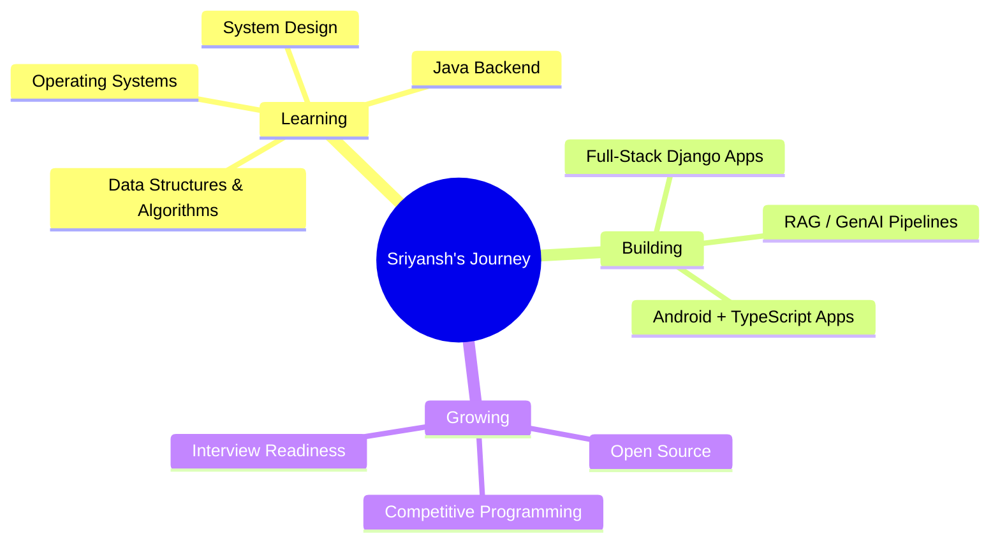

<div align="center">


<div align="center">

[](https://linkedin.com/in/sriyanshraj007)
[](mailto:sriyanshraj085@gmail.com)
[](https://github.com/sriyansh-dev)
[](https://leetcode.com/u/sriyanshraj_007/)
[](https://twitter.com/sriyanshraj007)


</div>

---

## 🎯 About Me

```typescript
const sriyansh = {
    location: "Greater Noida, UP, India 🇮🇳",
    education: "B.Tech CSE - 3rd Year @ Vishveshwarya Group of Institutions (AKTU) | CGPA: 8.2",
    role: "Full Stack Developer | AI/ML Enthusiast",
    currentFocus: ["DSA", "System Design", "Java Backend", "GenAI / RAG"],
    stack: ["Python", "Django", "Java", "TypeScript", "LangChain"],
    passion: ["Building end-to-end systems", "Solving hard DSA problems", "Calisthenics"],
    funFact: "Runs Arch Linux (CachyOS) because stability is a lifestyle choice — also learns faster by explaining things to friends",
    openTo: ["Internships", "Full Stack Roles", "AI/ML Collaborations", "Student-focused open-source projects"]
};
```

- 🤝 **Open to collaborate on:** Student-focused tools, open-source beginner projects, or anything that helps others learn
- 🧠 **Always curious about:** DSA and core CS subjects like OS and DBMS
- 🌱 **Currently exploring:** Java, Firebase, Git, and leveling up problem-solving on LeetCode
- 💬 **Ask me about:** Getting started with app dev as a student, GitHub portfolio tips, building mini projects that matter

<br clear="right"/>

---

## 🛠️ Tech Arsenal

<div align="center">

### Languages


### Backend & Web


### AI / ML


### Databases & Tools


</div>

---

## 💼 Featured Projects

<div align="center">

| Project | Description | Tech Stack |
|---|---|---|
| 🔎 **AI Fact-Checking Browser Extension** | Captures web content and verifies claims via a RAG pipeline | JS, Python, Django, LangChain, Chroma |
| 📋 **AI Grievance Redressal System** | Web + Android app with server-side routing and structured APIs | TypeScript, Python, Android |
| 📄 **NLP-based Resume Parser** | End-to-end pipeline: ingestion → NLP extraction → structured API output | Python, Django, Scikit-learn, Pandas |
| 🎨 **GAN Image Colorization App** | Trained a GAN model, deployed via an interactive Streamlit UI | Python, TensorFlow, PyTorch, Streamlit |

</div>

---

## 🌱 Open Source Contributions

- **ATS-Checker** — Resume ATS scoring tool
- **PyGitLoc** — GitHub lines-of-code counter
- **Object Detection** — Real-time YOLO/OpenCV detection
- **Image Colorization** — Caffe DNN-based restoration

---

## 📜 Certifications

<table>
<tr>
<td width="50%">

- ✅ HackerRank Python Certification
- ✅ Intro to NLP — Analytics Vidhya
- ✅ Data Analytics Job Simulation — Deloitte (Forage)
- ✅ Intro to Generative AI — Google Cloud
- ✅ Intro to Large Language Models — Google Cloud

</td>
<td width="50%">

- ✅ Intro to Responsible AI — Google Cloud
- ✅ Big Data & Data Science Bootcamp — C-DAC Noida
- ✅ Advanced C++ (85%) — IIT Bombay Spoken Tutorial
- ✅ Python Mega Course (10 Apps) — Udemy
- ✅ Python & Django for Beginners — Udemy

</td>
</tr>
</table>

---

## 📊 GitHub Analytics

<div align="center">


</div>

---

## 🏆 GitHub Trophies

<div align="center">

[](https://github.com/ryo-ma/github-profile-trophy)

</div>

---

## 🎯 Current Focus



---

## 🤝 Let's Connect

<div align="center">

Always open to internships, full stack roles, and AI/ML collaborations. Reach out — happy to talk shop.

[](https://linkedin.com/in/sriyanshraj085)
[](mailto:sriyanshraj085@gmail.com)
[](https://github.com/sriyansh-dev)

</div>

---

<div align="center">

**Built with Python, Django, and a lot of debugging by Sriyansh Raj**


</div>
