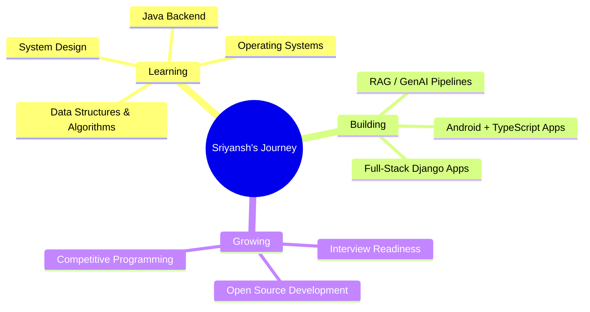

<div align="center">

<!-- Animated Header -->


</div>

<div align="center">
  
[](https://linkedin.com/in/sriyanshraj)
[](mailto:sriyanshraj085@gmail.com)
[](https://github.com/sriyansh-dev)


</div>

---

## 🎯 About Me

```typescript
const sriyansh = {
    location: "India 🇮🇳",
    education: "B.Tech CSE - 4th Year @ DR APJ Abdul Kalam Technical University | CGPA: 8.2",
    role: "JAVA Full Stack Developer | AI/ML Engineer",
    currentFocus: ["DSA", "System Design", "Java Backend", "GenAI / RAG"],
    passion: ["Building end-to-end systems", "Solving hard DSA problems", "Calisthenics"],
    superpower: "Architectural efficiency & clean API contracts",
    motto: "No fluff, no filler text, and no bloated code.",
    openTo: ["Internships", "Full Stack Roles", "AI/ML Automation", "Open-source projects"]
};
```


### 🚀 What Drives Me

- 💻 **Performance-First Engineer** - Driven by a performance-first philosophy, I design scalable backend architectures and build practical solutions for complex problems.
- 🤖 **AI/ML Specialist** - I optimize data pipelines (RAG) and deploy secure generative AI systems, ensuring low-latency communication.
- 🏗️ **Systems Architect** - Focused strictly on architectural efficiency and bulletproof system security.
- 🧩 **Problem Solver** - Passionate about solving hard DSA problems and leveling up logic on LeetCode.
- 🎯 **No-Nonsense Execution** - I focus on clean code and system layout; no fluff, no filler text, and no bloated code.

<br clear="right"/>

---

## 🏆 Achievements & Experience

<table>
<tr>
<td width="50%">

### 💼 Professional Experience
- 🚀 **Gen AI Intern** - IIT Kanpur Prabandhan & EiSystems Technologies (June 2026 - Aug 2026)
- 🚀 **AI & ML Intern** - Codomax Digital Solutions (July 2026)
- 👨‍💻 **Open Source Contributor** - Developed PyGitLoc and ATS-Checker

</td>
<td width="50%">

### 📜 Premium Certifications
- ✅ Certified LLM Security Professional
- ✅ Google AI Essentials & Intro to Generative AI
- ✅ Data Analytics Job Simulation (Deloitte / Forage)
- ✅ Big Data & Data Science Bootcamp (C-DAC Noida)
- ✅ Advanced C++ Training (85%) - IIT Bombay

</td>
</tr>
</table>

---

## 💼 Featured Engineering Projects

<div align="center">

| Project | Architecture & Description | Tech Stack | 
|---------|-------------|------------|
| 🤖 **SAGE (AI Code Reviewer)** | Gemini-powered AI tool that analyzes code, detects bugs/vulnerabilities, and automates optimization. | Python, MERN, Gemini, RAG |
| 🔍 **AI Fact-Checking Extension** | Captures web content and verifies claims via a robust RAG pipeline. | JS, Django, LangChain, Chroma |
| ⚖️ **AI Grievance Redressal** | End-to-end Web & Android app utilizing structured APIs and server-side routing. | TypeScript, Python, Android |
| 🎨 **GAN Image Colorization** | Trained a GAN model for image restoration, deployed via an interactive Streamlit UI. | TensorFlow, PyTorch, Streamlit |
| 📄 **NLP Resume Parser** | End-to-end extraction pipeline from data ingestion to structured NLP API output. | Python, Scikit-learn, Pandas |

</div>

---

## 🛠️ Tech Arsenal

<div align="center">

### Core Languages


### AI, ML & NLP


### Backend, Cloud & Architecture


### Databases & Developer Tools


</div>

---

## 📊 GitHub Analytics

<div align="center">
  


</div>

---

## 🏆 GitHub Trophies

<div align="center">
  
[](https://github.com/ryo-ma/github-profile-trophy)

</div>

---

## 📈 Contribution Graph

<div align="center">


</div>

---

## 💭 Dev Quote

<div align="center">


</div>

---

## 🎯 Current Focus


```mermaid
mindmap
  root((Sriyansh's Journey))
    Learning
      Data Structures & Algorithms
      System Design
      Operating Systems
      Java Backend
    Building
      RAG / GenAI Pipelines
      Full-Stack Django Apps
      Android + TypeScript Apps
    Growing
      Open Source Development
      Interview Readiness
      Competitive Programming
```

---

## 🤝 Let's Connect & Collaborate!

<div align="center">

If you want to talk system layout, LLM orchestration, or DevOps automation, cut the noise and reach out. Always open to internships, full stack roles, and AI/ML collaborations.

### 📬 Reach Out

[](https://linkedin.com/in/sriyanshraj)
[](mailto:sriyanshraj085@gmail.com)
[](https://github.com/sriyansh-dev)

### 💼 Open For

- 💻 Full-Stack Architecture Roles
- 🤖 Generative AI & NLP Integrations
- ⚙️ Scalable Backend & System Optimization
- 📚 Student-focused tools & Open Source
- 🚀 Internship Opportunities

</div>

---

<div align="center">

### 🌟 "No fluff, no filler text, and no bloated code." ✨

**Thanks for visiting! Let's architect something scalable together 🚀**


</div>

---

<div align="center">

**Architected with ☕ and optimized lines of code by Sriyansh Raj**


</div>
